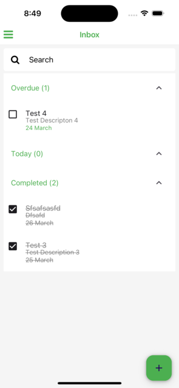
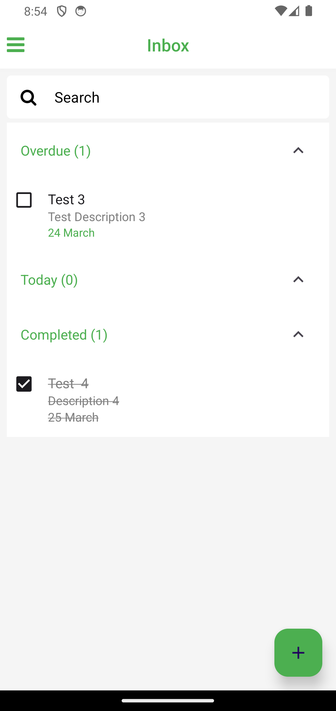

# Task Tracker

Task Tracker is a mobile application designed to help users manage their tasks efficiently. With Task Tracker, users can organize their tasks by different criteria such as today, tomorrow, this week, and completed tasks.

## Features

- **Today**: View tasks that are due today.
- **Tomorrow**: View tasks that are due tomorrow.
- **This Week**: View tasks that are due within the current week.
- **Completed**: View tasks that have been marked as completed.
- **Create Task**: Add new tasks to the task list.

## Technologies Used

- **React Native**: Task Tracker is built using React Native, a popular framework for building mobile applications with JavaScript and React.
- **React Navigation**: Used for navigation between different screens within the application.
- **Zustand**: Used for state management in React components.
- **FontAwesome**: Provides icons for the user interface elements.

## Installation

To run the Task Tracker application locally on your machine, follow these steps:

1. Clone the repository: `git clone <repository-url>`
2. Navigate to the project directory: `cd task-tracker`
3. Install dependencies: `npm install`
4. Start the Metro bundler: `npm start`
5. Run the application on your preferred platform using Expo CLI: `expo start`

Make sure you have Node.js, npm, and Expo CLI installed on your machine before proceeding with the installation.

## Usage

Once the application is running, you can use it to manage your tasks by navigating through different sections such as today, tomorrow, this week, and completed tasks. You can add new tasks using the "+" button at the bottom of the screen.

## Contributing

Contributions to Task Tracker are welcome! If you find any bugs or have suggestions for improvements, please open an issue or submit a pull request on GitHub.

# App Screenshots

 

 

